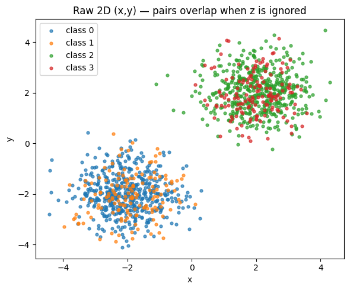
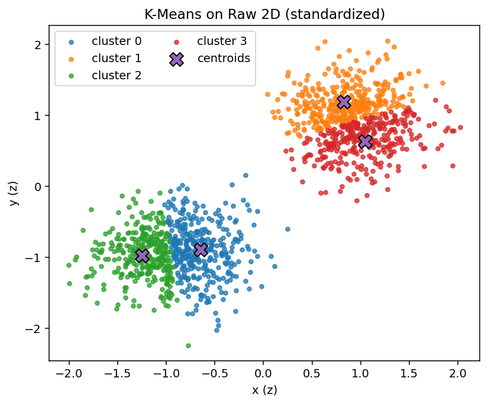
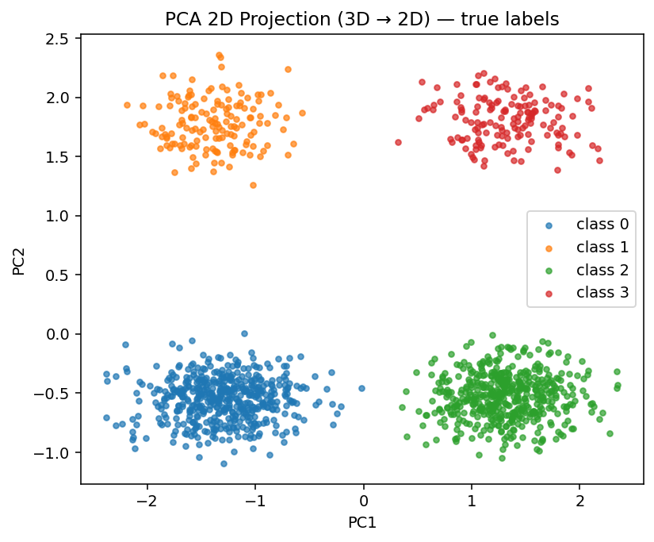
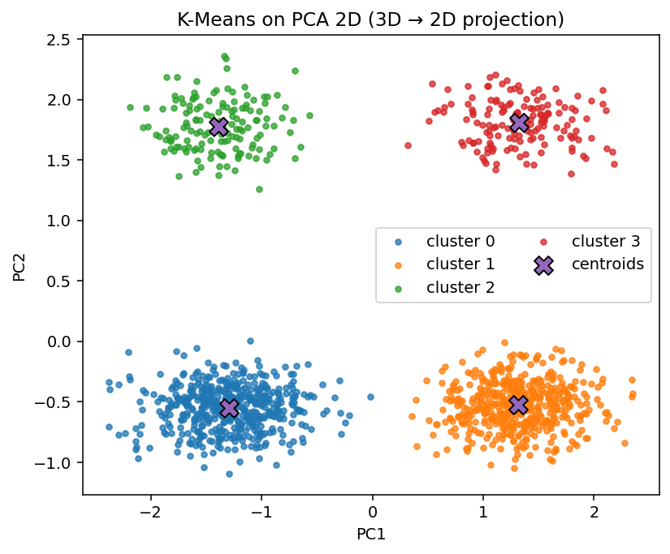

# 🎯 PCA Reveals Hidden Structure — 4-Cluster Demo
**Author:** *Yazdan Ghanavati*

This mini-project is a **visual proof** that the feature space matters.  
We build a 3D dataset with **four clusters** (two big, two small).  
If you ignore the z-dimension and only look at (x, y), the four clusters **collapse into two blobs**.  
**K-Means** on raw (x, y) looks neat but **splits each blob arbitrarily** → wrong.  
After **PCA (3D → 2D)**, the hidden z-structure is revealed and K-Means becomes **perfect**.

> PCA doesn’t invent information — it **finds the right axes** so the information you already have becomes visible.


## 🗺️ Quick links
- Notebook: `01_pca_4cluster_demo.ipynb`
- Figures:
  - `figures/raw_true.png` — Raw (x, y) with **true labels**
  - `figures/raw_kmeans.png` — K-Means on raw (x, y)
  - `figures/pca_true_labels.png` — PCA(2D) with **true labels**
  - `figures/pca_kmeans.png` — K-Means on PCA(2D)


## 🔧 Problem Setup — Data Design (Why this dataset?)
We create 4 Gaussian clusters in 3D with the following intent:

| Cluster | (x, y) center | z level | Size | Purpose |
|:------:|:--------------:|:-------:|:----:|:--------|
| 0 | (−2, −2) | −5 | 500 | Big cluster at left/low-z |
| 1 | (−2, −2) | +5 | 150 | Small cluster at left/high-z |
| 2 | ( +2, +2) | −5 | 500 | Big cluster at right/low-z |
| 3 | ( +2, +2) | +5 | 150 | Small cluster at right/high-z |

- **Pairs share (x, y)** (0 with 1, and 2 with 3).  
- Only **z** separates the pair at each location.  
- If you drop **z** and plot only (x, y), the pair collapses into **one blob** → any 2D clustering on (x, y) alone will be conceptually wrong.


## 🖼️ Figure 1 — Raw (x, y) with *true* labels


**What you’re seeing:** two big blobs (left/right).  
Each blob actually contains **two different classes** (low-z and high-z), but in (x, y) they lie on top of each other.

**Why this matters:** any algorithm that only sees (x, y) cannot separate the pair correctly — the best it can do is invent an arbitrary split *within* each blob.


## 🖼️ Figure 2 — K-Means on Raw (x, y) (conceptually wrong)


**What to look for:**
- You still see two blobs, but K-Means (k=4) puts **two centroids** in each blob and splits them.
- The split **doesn’t align** with the true classes (which differ in z, not in the way K-Means is slicing x or y).

**Why it’s wrong (geometrically):**
- K-Means uses Euclidean distances in the chosen space.  
- In (x, y), both classes at the same location are **indistinguishable**, so K-Means is forced to partition a single blob into two halves.  
- It “looks tidy,” but it **doesn’t match the true labels**.

**Numbers (from this run):**
- Silhouette = **0.317** (mediocre separation/compactness)
- ARI = **0.395**, NMI = **0.531** (only moderate agreement with truth)


## 🧠 PCA in 6 lines
1) Standardize features so units don’t dominate.  
2) Compute covariance of the data.  
3) Find **orthogonal directions** (principal components) with maximum variance.  
4) Project data onto top PCs → a compact, uncorrelated representation.  
5) In our case, one PC aligns with the **hidden z contrast**; another with the **x/y spread**.  
6) The 3D story is now visible in **2D**.

> In this run: PC1 + PC2 explain **95.6%** of variance.


## 🖼️ Figure 3 — PCA(2D) with *true* labels (hidden structure revealed)


**What to look for:** four clean, well-separated clusters.  
PC1 and PC2 now encode both the horizontal separation **and** the previously invisible z-difference.

**Takeaway:** the data wasn’t hard — the **representation** was wrong.  
PCA gives K-Means the right space to work in.


## 🖼️ Figure 4 — K-Means on PCA(2D) (now correct)


**What to look for:**  
- One centroid per true cluster; tight, non-overlapping groups.

**Numbers (from this run):**
- Silhouette = **0.778** (strong separation/compactness)  
- ARI = **1.000**, NMI = **1.000** (perfect agreement with truth)

**Conclusion:** once the hidden factor is exposed by PCA, even a simple algorithm like K-Means becomes **trivially correct**.


## 📊 Results Summary

| Space | Silhouette | ARI | NMI |
|:------|:-----------:|:----:|:----:|
| Raw 2D (x, y) | 0.317 | 0.395 | 0.531 |
| **PCA 2D (3D→2D)** | **0.778** | **1.000** | **1.000** |

**How to read:**
- **Silhouette** ∈ [−1, 1]: geometry-based; higher = clusters are more compact and further apart.  
- **ARI** ∈ [−1, 1] & **NMI** ∈ [0, 1]: compare clustering to true labels; **1.0 = perfect** and permutation-invariant.


## ❌ Why raw (x,y) fails
- Two true classes (low-z & high-z) **project onto the same (x,y) region**.  
- Euclidean distance in (x,y) can’t distinguish them.  
- K-Means must split blobs **arbitrarily**, yielding misleading clusters and mediocre ARI/NMI.

## ✅ Why PCA works
- PCA “rotates” axes to align with **variance directions** in the full 3D space.  
- One PC captures the hidden **z contrast** within each blob.  
- After projection onto (PC1, PC2), **each true class owns its own region**, making the task trivial for K-Means.


## 🔁 Reproducibility

### Environment
```bash
python -m venv .venv
# macOS/Linux
source .venv/bin/activate
# Windows (PowerShell)
.venv\Scripts\Activate.ps1
pip install -r requirements.txt
```

